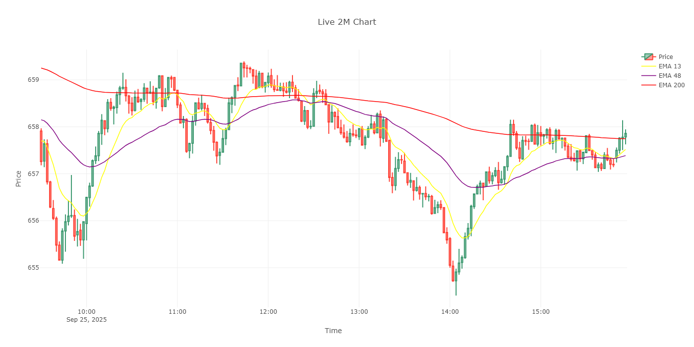
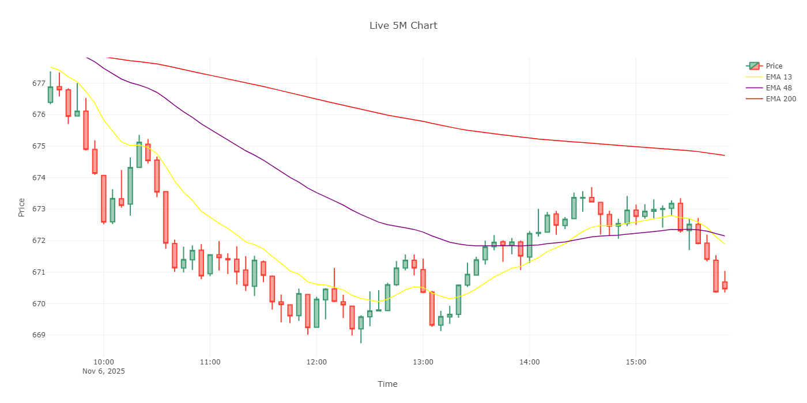

# Flag Zone Bot 📈


## Overview

**Flag Zone Bot** is my personal algorithmic trading system for SPY that detects dynamic supply/demand zones and adaptive bull/bear flags across multiple timeframes, executes option orders automatically, and ships real‑time visuals via a Plotly Dash web app. Not financial advice; for educational/personal use only.

## What this bot does

- **Streams live trades**, builds candles (2M/5M/15M …), and maintains the latest price in shared state.
- **Calculates EMAs** per timeframe and overlays them on live charts.
- **Finds zones & levels** from 15‑minute history and renders them as bands/lines.
- **Detects adaptive flags** using slopes (not fixed lines). (See project overview.)
- **Executes orders and logs to Discord** (order modules not covered here in depth). Overview in README.
- **Publishes a web dashboard** with:
  - Zones Chart (15M history)
  - Live 15M, 5M, 2M charts (candles + EMAs)
  - Real‑time updates pushed via a FastAPI WebSocket broadcaster.

This system analyzes the market using:

- Dynamic supply & demand **zones**
- Adaptive **bull & bear flags** detection via slope algebra, not static lines
- Multiple **timeframes** for a multi-perspective market view
- Real-time **option order execution** with automatic scaling in/out
- **Discord notifications** for each trading step

> **Note:** This project is for personal development only — **not financial advice**, not for other traders, and not for public use.

---

### Most Recent Live **2 Minute Chart:**



### Most Recent Live **5 Minute Chart:**



### Most Recent Live **15 Minute Chart:**


### Most Recent Zones/Levels **15 Minute Chart:**


---

## Key Concepts

✅ **Dynamic Zones:**  
Zones are calculated daily from fresh SPY price data, using an evolving algorithm that continuously improves.

✅ **Flag Detection:**  
Instead of static y=mx+b flag patterns, this version uses adaptable slopes to track price action changes in real time.

✅ **EMA Logic:**  
A 200 EMA filter was tested: trade only flags that align with macro EMA trend.

✅ **Fully Automated Orders:**  
Handles buying options, managing profits with tiered trimming, stop loss logic, and automatic logging to Discord.

✅ **Always Improving:**  
Old versions were heavily overfit. This version’s design is modular — with separate branches for **live** and **experimental** logic.

✅ **Live Visuals:**  
Charts for 15-min and 2-min candles update live, showing the bot’s “vision” and calculated zones/levels.

---

## CI & Tests

- ✅ **Automated Checks:**  
  GitHub Actions runs continuous integration (`.github/workflows/python-ci.yml`).

---

## Future Plans

- Add more timeframes to expand the bot’s “sightlines.”
- Build a better UI for live status.
- Improve “how it sees” vs. “how it acts” logic split.
- Test more strategies beyond SPY.

---

## Big-picture architecture

```bash
             ┌────────────────────────────────────────────────────────┐
             │                        Backend                         │
             │                                                        │
Market Data  │  ws_auto_connect (Tradier/Polygon)  →  process_data    │
 (Trades) ───┼── streams → build candles → write logs (per timeframe) │
             │                ↑ latest_price in shared_state          │
             │                └→ update_ema → update_chart (PNG)      │
             └────────────────────────────────────────────────────────┘
                                │               ▲
                                │ HTTP trigger  │ WebSocket push
                                ▼               │
             ┌────────────────────────────────────────────────────────┐
             │                        Services                        │
             │  FastAPI (ws_server):                                  │
             │   - POST /trigger-chart-update → broadcast "chart:TF"  │
             │   - WS /ws/chart-updates → clients subscribe           │
             └────────────────────────────────────────────────────────┘
                                │
                                ▼
             ┌────────────────────────────────────────────────────────┐
             │                         UI (Dash)                      │
             │  Tabs: Zones (15M history), Live 15M/5M/2M charts      │
             │  On WS message "chart:TF" → regenerates that figure    │
             └────────────────────────────────────────────────────────┘
```

---

## ⚠️ Disclaimer

This project is for **educational and personal development** only.  
It is **not financial advice**.  
No recommendations are made for actual trading.

---

## 📂 Project Structure

```bash
Flag-Zone-Bot/
├── .git/
├── .github/
│   └── workflows/
│       └── python-ci.yml
├── __pycache__/
├── docs/
│   ├── adr/
│   │   └── 0001-separate-frontend-from-backend.md
│   └── TOC.md
├── indicators/
│   ├── ema_manager.py
│   └── flag_manager.py
├── logs/
│   ├── log files... # SPY_2M.log, SPY_5M.log, SPY_15M.log 
│   └── terminal_output.log
├── states/
├── storage/
│   ├── csv/ 
│   │   ├── order_log.csv
│   │   └── SPY_15_minute_candles.csv
│   ├── data/ 
│   │   ├── 2m/
│   │   │   └── 2025-09-02.parquet
│   │   ├── 5m/
│   │   │   └── 2025-09-02.parquet
│   │   └── 15m/
│   │       └── 2025-09-02.parquet
│   ├── emas/
│   │   ├── 2M.json
│   │   ├── 5M.json
│   │   └── 15M.json
│   ├── flags/ 
│   │   ├── 2M.json
│   │   ├── 5M.json
│   │   └── 15M.json
│   ├── images/ # this is where everything chart/image-wise is saved
│   │   ├── SPY_2M_chart.png
│   │   ├── SPY_5M_chart.png
│   │   ├── SPY_15M_chart.png
│   │   └── SPY_15M-zone_chart.png
│   ├── markers/ 
│   │   ├── 2M.json
│   │   ├── 5M.json
│   │   └── 15M.json
│   ├── objects/ 
│   │   │   └── 15m/
│   │   ├── objects.json
│   │   └── timeline.json 
│   ├── duck.py
│   ├── message_ids.json
│   ├── parquet_writer.py
│   ├── viewport.py
│   ├── week_ecom_calendar.json
│   └── week_performances.json
├── strategies/
│   └── trading_strategy.py
├── tests/ # This is for `Unit Tests`
│   ├── storage_unit_tests/ 
│   │   ├── conftest.py
│   │   ├── test_compaction.py
│   │   ├── test_parquet_writer.py
│   │   └── test_viewport.py
│   └── purpose.md
├── tools/
│   ├── __init__.py
│   ├── compact_parquet.py
│   ├── generate_structure.py
│   └── plot_candles.py
├── utils/
│   ├── __pycache__/
│   ├── data_utils.py
│   ├── ema_utils.py
│   ├── file_utils.py
│   ├── json_utils.py
│   ├── log_utils.py
│   ├── order_utils.py
│   └── time_utils.py
├── venv/  # You need to make this then `pip install -r requirements.txt`
├── web_dash/
│   ├── __init__.py
│   ├── dash_app.py
│   ├── chart_updater.py
│   ├── ws_server.py
│   ├── about_this_dash_folder.txt
│   ├── charts/
│   │   ├── live_chart.py
│   │   └── zones_chart.py
│   └── assets/
├── .gitignore
├── buy_option.py
├── config.json
├── cred.py
├── data_acquisition.py
├── economic_calender_scraper.py
├── error_handler.py
├── main.py
├── objects.py
├── order_handler.py
├── paths.py
├── print_discord_messages.py
├── README.md # THIS    
├── requirements.txt
├── rule_manager.py
├── sentiment_engine.py
├── shared_state.py
└── submit_order.py
```

---

**Built and maintained by [[Merced3](https://github.com/Merced3)]**  
*Always learning. Always building.*
