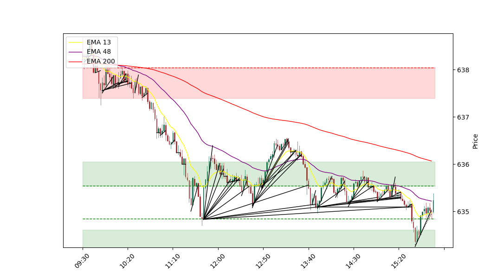
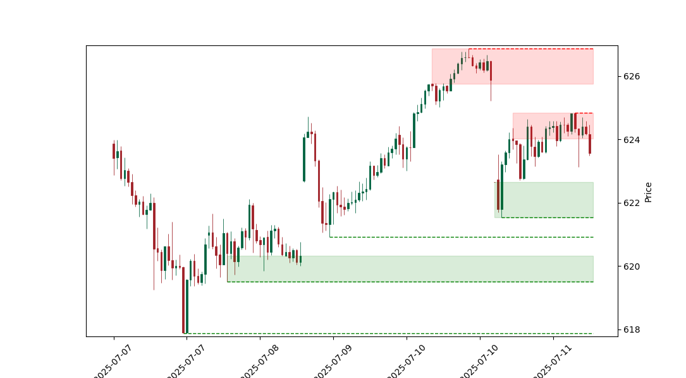

# Flag Zone Bot 📈


## Overview

**Flag Zone Bot** is my personal algorithmic trading project, built and tested for the SPY ETF for over two years.

This system analyzes the market using:

- Dynamic supply & demand **zones**
- Adaptive **bull & bear flags** detection via slope algebra, not static lines
- Multiple **timeframes** (15-minute and 2-minute) for a multi-perspective market view
- Real-time **option order execution** with automatic scaling in/out
- **Discord notifications** for each trading step

> **Note:** This project is for personal development only — **not financial advice**, not for other traders, and not for public use.

---

### Most Recent **2 Minute Chart:**



### Most Recent **15 Minute Chart:**



---

## Key Concepts

✅ **Dynamic Zones:**  
Zones are calculated daily from fresh SPY price data, using an evolving algorithm that continuously improves.

✅ **Flag Detection:**  
Instead of static y=mx+b flag patterns, this version uses adaptable slopes to track price action changes in real time.

✅ **EMA Logic:**  
A 200 EMA filter was tested: trade only flags that align with macro EMA trend.

✅ **Fully Automated Orders:**  
Handles buying options, managing profits with tiered trimming, stop loss logic, and automatic logging to Discord.

✅ **Always Improving:**  
Old versions were heavily overfit. This version’s design is modular — with separate branches for **live** and **experimental** logic.

✅ **Live Visuals:**  
Charts for 15-min and 2-min candles update live, showing the bot’s “vision” and calculated zones/levels.

---

## CI & Tests

- 🧪 **Integration Tests:**  
  I maintain a `/tests` directory with integration tests for critical features like the chart’s 24/7 stability.

- ✅ **Automated Checks:**  
  GitHub Actions runs continuous integration (`.github/workflows/python-ci.yml`).

---

## Future Plans

- Add more timeframes to expand the bot’s “sightlines.”
- Build a better UI for live status.
- Improve “how it sees” vs. “how it acts” logic split.
- Test more strategies beyond SPY.

---

## ⚠️ Disclaimer

This project is for **educational and personal development** only.  
It is **not financial advice**.  
No recommendations are made for actual trading.

---

## 📂 Project Structure

```bash
Flag-Zone-Bot/
├── .git/
├── .github/
│   └── workflows/
│       └── python-ci.yml
├── __pycache__/
├── logs/
│   ├── SPY_2M.log
│   └── terminal_output.log
├── states/
├── storage/
│   ├── objects/
│   │   ├── objects.json
│   │   └── timeline.json
│   ├── EMAs.json
│   ├── Project_Tasks.md
│   ├── SPY_2-min_chart.png
│   ├── SPY_15-min_chart.png
│   ├── SPY_15_minute_candles.csv
│   ├── line_data.json
│   ├── markers.json
│   ├── message_ids.json
│   ├── order_candle_type.json
│   ├── order_log.csv
│   ├── priority_candles.json
│   ├── week_ecom_calendar.json
│   └── week_performances.json
├── tests/
│   ├── test_chart_root.py
│   └── test_smoke.py
├── tools/
│   ├── generate_structure.py
│   └── plot_candles.py
├── utils/
│   ├── __pycache__/
│   ├── data_utils.py
│   ├── file_utils.py
│   ├── json_utils.py
│   ├── log_utils.py
│   ├── order_utils.py
│   └── time_utils.py
├── venv/ # Make this
├── .gitignore
├── ERRORs.tct
├── README.md
├── buy_option.py
├── chart_visualization.py
├── config.json
├── cred.py
├── data_acquisition.py
├── economic_calender_scraper.py
├── error_handler.py
├── flag_manager.py
├── main.py
├── objects.py
├── order_handler.py
├── paths.py
├── print_discord_messages.py
├── requirements.txt
├── rule_manager.py
├── sentiment_engine.py
├── shared_state.py
├── submit_order.py
└── tll_trading_strategy.py
```

---

**Built and maintained by [[Merced3](https://github.com/Merced3)]**  
*Always learning. Always building.*
